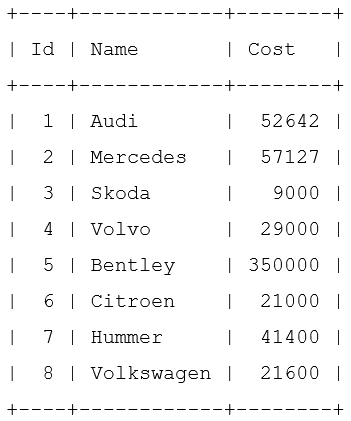
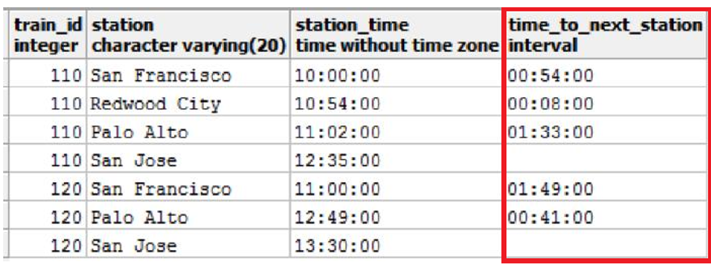

# SQL. Семинар 5. Домашнее задание

## Задание 1.
Дана таблица:  
  
1. Создайте представление, в которое попадут автомобили стоимостью  до 25 000 долларов.
2. Изменить в существующем представлении порог для стоимости: пусть цена будет до 30 000 долларов (используя оператор ALTER VIEW).
3. Создайте представление, в котором будут только автомобили марки “Шкода” и “Ауди”.

## Задание 2.
Вывести название и цену для всех анализов, которые продавались 5 февраля 2020 и всю следующую неделю.  

**Есть таблица анализов Analysis**:  
an_id — ID анализа;  
an_name — название анализа;  
an_cost — себестоимость анализа;  
an_price — розничная цена анализа;  
an_group — группа анализов.  
**Есть таблица групп анализов Groups**:  
gr_id — ID группы;  
gr_name — название группы;  
gr_temp — температурный режим хранения.  
**Есть таблица заказов Orders**:  
ord_id — ID заказа;  
ord_datetime — дата и время заказа;  
ord_an — ID анализа.  

## Задание 3.
Добавьте новый столбец под названием «время до следующей станции». 
  

Чтобы получить это значение, мы вычитаем время станций для пар смежных станций. Мы можем вычислить это значение без использования оконной функции SQL, но это может быть очень сложно. Проще это сделать с помощью оконной функции LEAD. Эта функция сравнивает значения из одной строки со следующей строкой, чтобы получить результат. В этом случае функция сравнивает значения в столбце «время» для станции со станцией сразу после нее.

